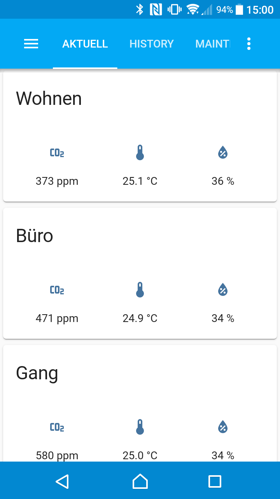
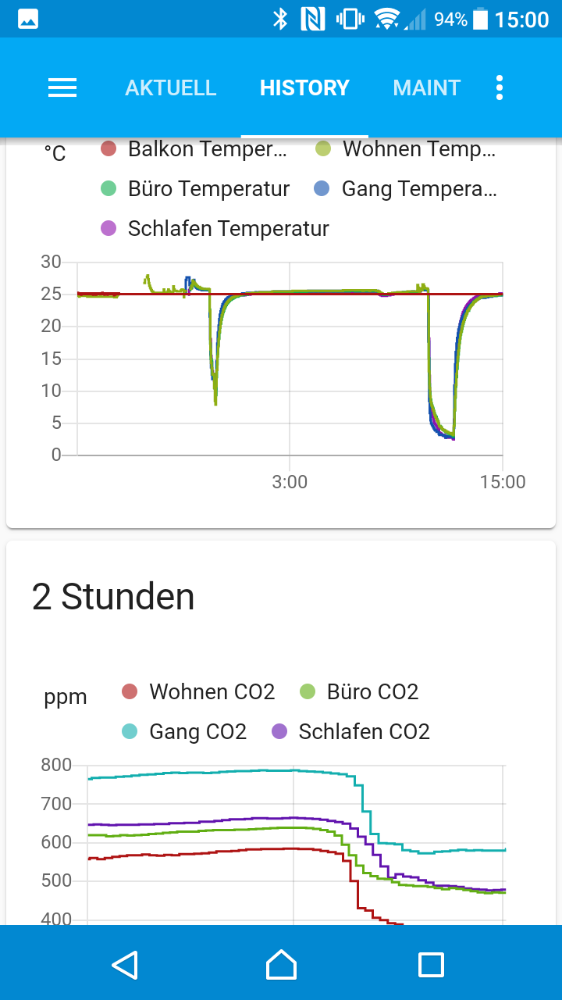
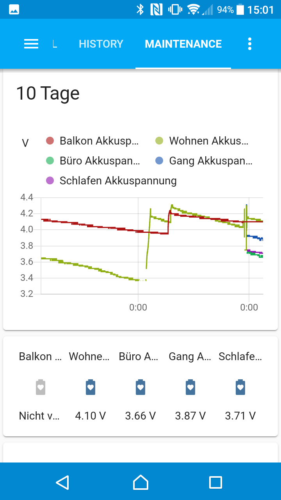
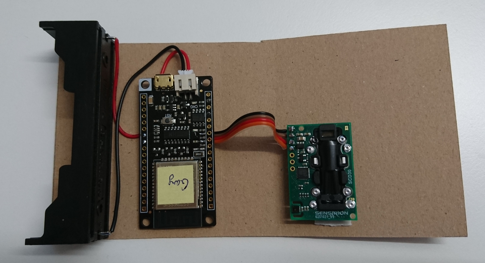
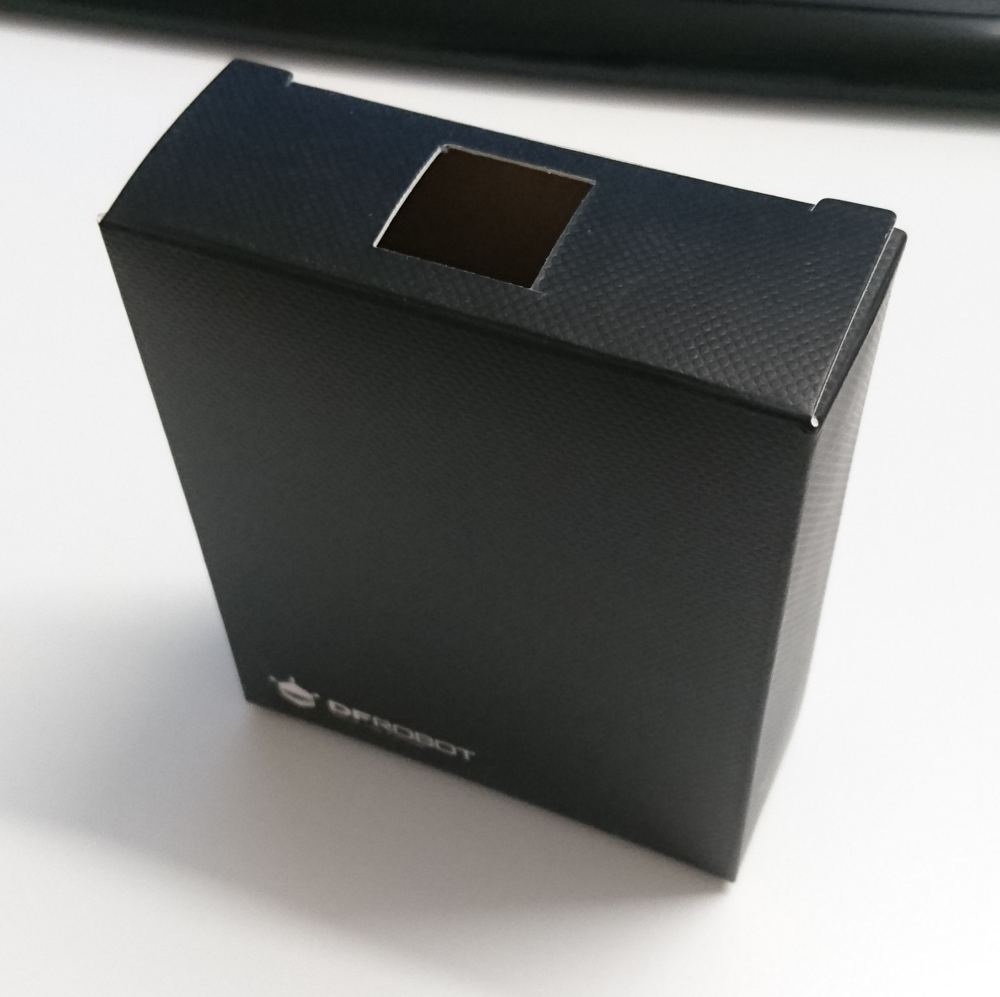
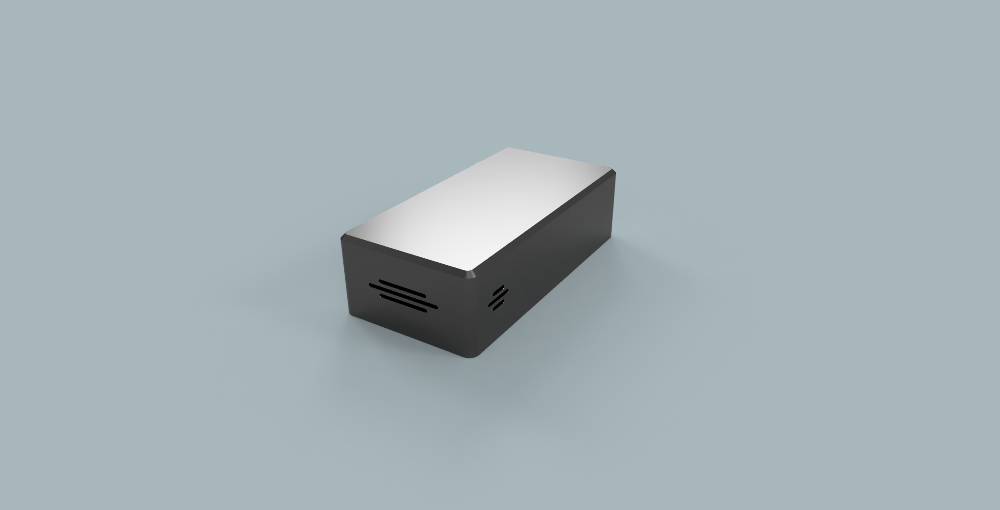
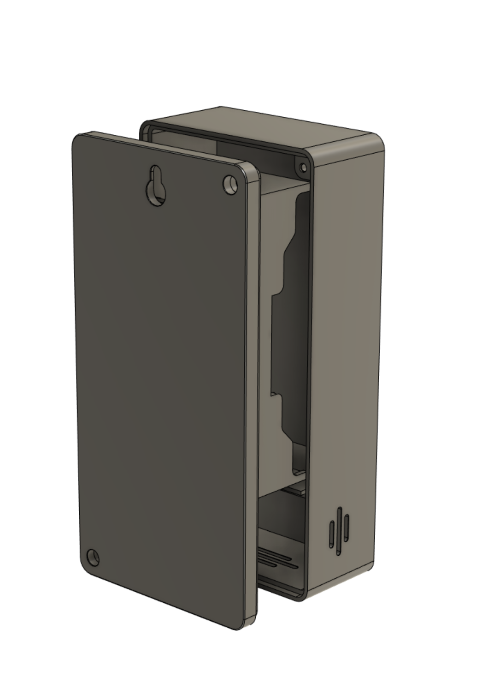
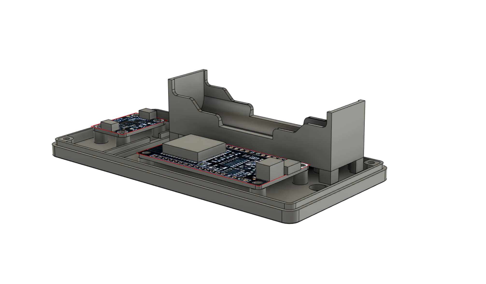

homesensor
==========

Air quality sensor designed for battery operation and central data collection in HomeAssistant.

Introduction
------------

This project contains all things needed to setup e.g. a sensor grid for monitoring
temperature, humidity an CO2-levels in several rooms in your home and maybe outside.

The sensors are built from scratch with an `ESP32` as compute unit
and a sensirion `SHTC3` for temperature and humidity monitoring.
For additional CO2-level measurement an sensirion `SCD30` can be used.
The software is based on `platform-io` and is therefore easy to build and deploy.

The sensor data is sent via W-LAN and MQTT protocol to `home assistant` on the backend server.
Home assistant is at first place a home automation system.
But one part of automation is to collect data from sensors.
We therefore use this mechanisms and the corresponding Web-GUI
to have a flexible way to store and visualize the collected data.

Getting started
---------------

The whole project consists of the following parts:

* [Backend Software](backend/)
* [Hardware](hardware/)
* [Device Software](software/)

See the linked sub-pages for further instructions.

Usage
-----

### Indoor - SCD30

### Outdoor - SHTC3

License
-------

MIT

Versioning
----------

There exists no version numbers, releases, tags or branches.
The master should be considered the current stable release.
All other existing branches are feature/development branches and are considered unstable.

Author Information
------------------

Christian Lang

[lang.chr86@gmail.com](mailto:lang.chr86@gmail.com)

Credits
-------

* 3D printed Case: [langdesign.ch](https://langdesign.ch/)
