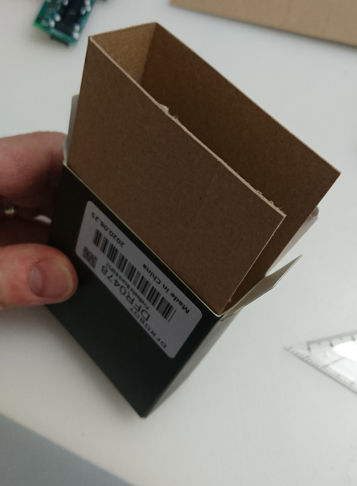
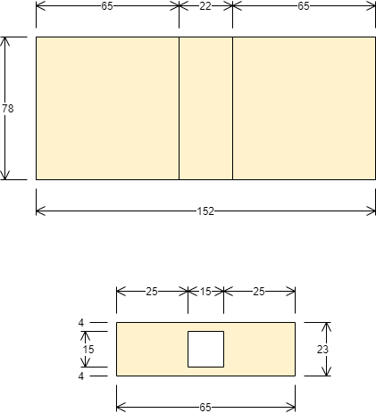
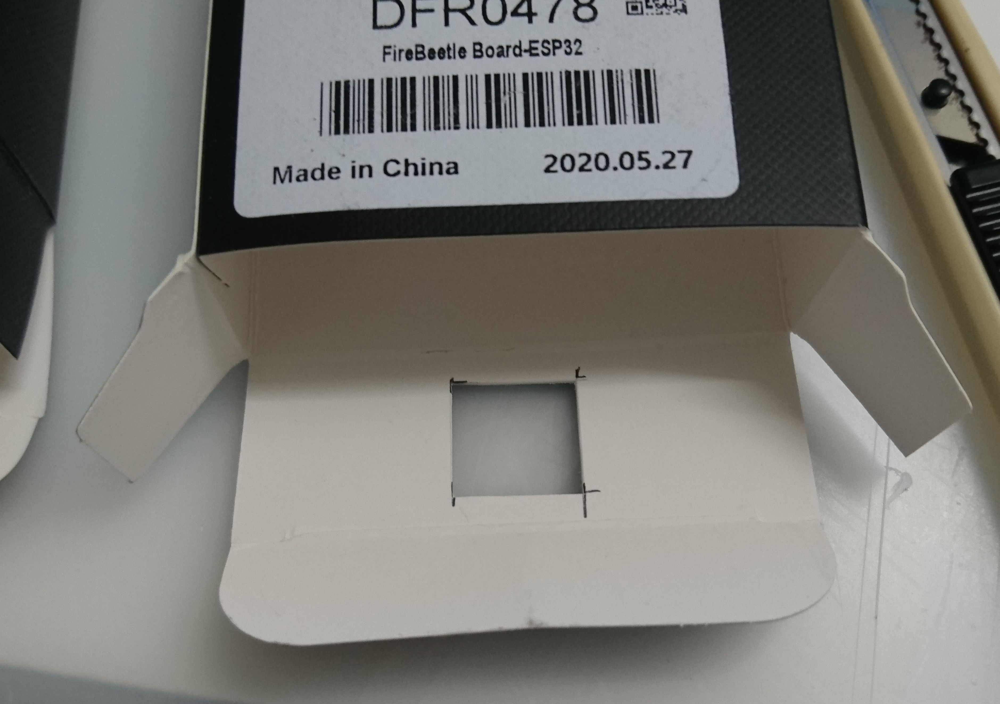
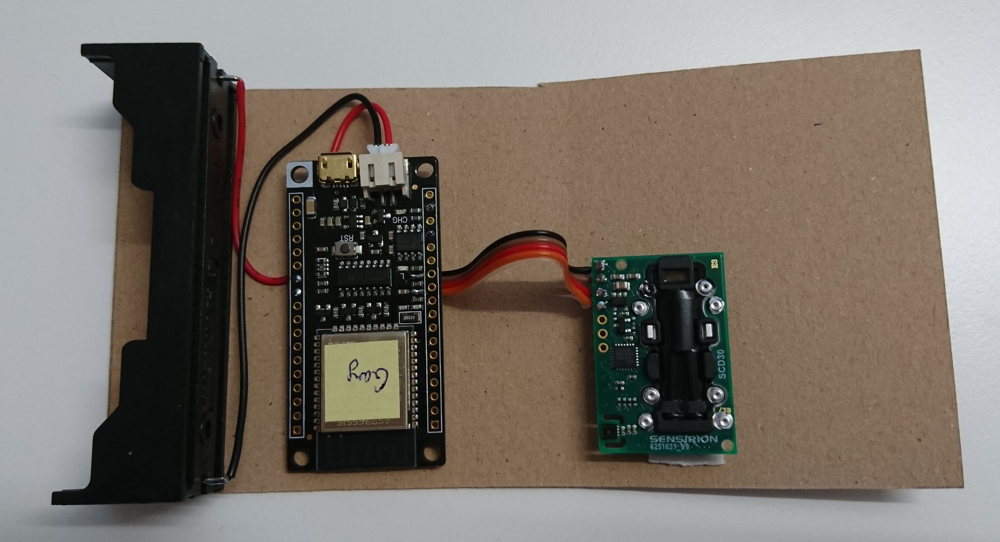

Device production
=================

Bill of Material
----------------

* DFRobot Firebeetle ESP32: [1738-1302-ND](https://www.digikey.ch/product-detail/de/dfrobot/DFR0478/1738-1302-ND/7398878)
* Adafruit breakout board: Sensirion SHTC3: [1528-4636-ND](https://www.digikey.ch/product-detail/de/adafruit-industries-llc/4636/1528-4636-ND/12504001)
* Sensirion SCD30: [1649-1098-ND](https://www.digikey.ch/product-detail/de/sensirion-ag/SCD30/1649-1098-ND/8445334)
* 18650 Battery holder: [BH-18650-PC-ND](https://www.digikey.ch/product-detail/de/mpd-memory-protection-devices/BH-18650-PC/BH-18650-PC-ND/3029216)
* JST 2pin power connector: [1528-1126-ND](https://www.digikey.ch/product-detail/de/adafruit-industries-llc/261/1528-1126-ND/5353586)

Firebeetle preparation
----------------------

First we have to prepare the CPU board.
The main thing we have to do is to enable the input voltage measurement.
For this we have to short two prepared jumbers or place 0Ohm resistors.
Those are the `R10` and `R11` on the board.

Indoor sensor
-------------

First correctly wire the sensor to the CPU board.

We use the box in which the ESP32 was delivered as a case.
This has a good size and is good enough for indoor usage.
The electronic parts are assembled to an additional cardboard.

The box need to have air holes on both lids to enable air flow.

The eletronic parts are attached to the cardboard with adhesive tape.

The cardboard can then be inserted in the box.

Outdoor sensor
--------------

If you want to have as less power consumption
and most importantly no always glowing LED
you have to remove it from the Adafruit board.

TBD:

* use direct 3.3V in
