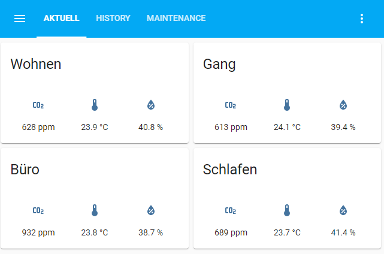

Software
========

Getting started
---------------

The simplest way to work with PlatformIO is to setup Visual Studio Code and the corresponding extension.
See: [platformio.org/install/ide?install=vscode](https://platformio.org/install/ide?install=vscode)

After the installation of the IDE the project should be cloned with git.
Open the sub folder `software` in vscode.
Now you start compilation and flashing with the control elements in the bottom status line of vscode.

If the serial adapter of the ESP is not detected you may need the corresponding driver.
Usually the one in the `driver` subfolder is working on Windows 10.

Configuration
-------------

The default state of the code will not work because it contains no credentials for your Wifi network
and also the IPs should be changed in most cases.
All those things that should/can be configured are contained in the file `src/config.h`.

Things that almost always need to be adapted to the specific environment are:

* Wifi credentials
* Home assistant IP
* Network gateway/mask
* MQTT credentials and port (can be left as is if the default empty fields were used at setup of home assistant)

**Ensure that you never push commits to remotes that contain your private credentials!**

After those central parts the individual sensor devices can be added to the device list.
To be able to have a simple deployment process all devices can be added
and at deplyoment only the `kDeviceConfigIndex` needs to be adapted to switch to different sensor devices.

Home assistant visualization
----------------------------

After the corrected credentials etc. has been set and a correctly built sensor has been flashed
it should start to send messages after a few seconds to the home assistant server.
A correct startup is visualized by fast blinking (500ms interval) blue LED after hardware initialization.
Because the sensor devices use auto configuration
they should automatically appear under `devices` in home assistant.
Auto configuration happens at first start, after multiple consecutive failed boots
or if configured with `kHaConfigInterval` in regular intervals.
Then they can be used to setup data visualizations on `lovelace dashboards` in home assistant.

The sent data fields are grouped to sensor devices.
If you defined a sensor with the name `buero`
you will see the corresponding data entities named like `sensor.buero_co2`.

There exists multiple categories of data fields that are sent to home assistant:

* sensor data: temperature, humidity, CO2
* battery information: voltage, approx. capacity
* debug information: boot count, readout interval, mode string

To see all sent fields and their configuration
you can enable logging (see development section)
and watch the first boot.
The serial output will show the exact JSON data that is sent via MQTT to home assistant.

Battery Operation
-----------------

This project does focus on battery operation.
Therefore a computing platform has been choosen that supports low power consumption
and integrated charging possibilities.
Charging is enabled by simply connecting a power source to the micro USB connection.
The charging is visualized by the red LED.
After charging is complete the LED will switch off.

**Attention:** Measurements will be influenced by the heat generated by the charging circuit.

Low power operation is realized by going to deep sleep after each sensor readout and data sending.
The power consumption of the CPU during deep sleep is about 10 uA.
Sadly the more relevant consumers are the sensors.
Where the SHTC3 board does increase the consumption to about 100 uA.
The SCD30 is even more demanding and increases the consumption up to about 4-6 mA during sleep.
The deep sleep duration can be adjusted by `kDefaultReadoutInterval` in `src/config.h`.

During sensor readout, processing and data sending, the consumption increases to 150 mA at maximum.
This high demand is mainly triggered by the Wifi connection setup and data sending.
The whole awake state usually needs about 2-3 seconds.
In case of the SCD30 it can take even longer.
This is because of the not exactly synchronized readout interval and sensor read.

With those numbers we can approx. calculate a possible runtime with one battery charge:
[Battery life calculator](http://www.of-things.de/battery-life-calculator.php).
Measured runtime of sensors with readout interval of 2 minutes and a battery of 2500 mAh capacity are:

* SCD30: 2 weeks
* SHTC3: more than 1 month

### Increase readout interval during problems

The configured readout interval can change during runtime because of different software problems.
Main source of such readout aborts are no sensor data or no Wifi connection.
In all those cases the device aborts the readout and goes to sleep again.
After the third consecutive aborted wake up the readout interval is doubled.
This is to reduce the failing tries
and therefore also reduce power consumption.
This helps to increase battery lifetime in cases where it is useless to try in short intervals.
This may be helpfull e.g. if a Wifi hotspot is regularly not available (e.g. during night).
The readout interval is increased to a maximum of `kMaxReadoutInterval`.
It is reset after a successfull readout.

### Low power mode

Because the li-ion battery is sensible to low discharge
the device does reduce power consumption if the battery voltage goes under 10% of maximum capacity.
This is checked in the `Sleep` function in `src/main.cpp`.
In such cases the readout interval goes directly to maximum of `kMaxReadoutInterval`.
This is also helpfull to notify the user about low power
because the sensor data will become sparse.
That behavior is triggered because of the maximum readout interval is much longer
than the expiration time of individual sensor data in home assistant.

Power supply operation
----------------------

You should remove the battery
if you want to operate the sensor with a power supply constantly connected.
This is because measurements will be influenced by the heat generated by the charging circuit.

In addition the temperature measurement may differ because of different voltage levels given to the sensor.
Therefore you may need to adapt the temperature offset/calibration mentioned below in the "Known issues" section.

Calibration
-----------

### CO2

The measurement of CO2 concentration is no simple task.
This is reflected in the high price of such sensors.
In addition such sensors need to be calibrated from time to time and especially before first commissioning.
The used SCD30 sensor has various mechanisms to reduce sensor drift over time.
But even we do only need to calibrate the sensor approx. once a year,
we have to calibrate it at least at first setup.

The software has a special calibration mode for this
that can be started by shorting the GPIO-4 to GND at startup.
This mode can only be enabled during first boot
and is then visualized by the slow blinking (2s interval) blue LED at startup.
The simplest method to do this is to shorten the GPIO and then pressing the hardware reset button on the ESP.
Any kind of wire can be used to shorten the pins.
Even a curved staple will do.

After the calibration mode is visualized by the LED, the wire can be removed
and the sensor should be placed in fresh air that has usually normal CO2 concentration of 400 ppm.
The calibration mode is also visualized in the `mode` string sent to home assistant.
The sensor should be left in fresh air until the `calib` string disappears in the mode.
The calibration time depends on the readout interval.
For intervals bigger than 1 minute it is 10 times bigger than the configured interval.
For smaller intervals it is 10 minutes.

Calibration parameters are stored in the sensor itself and not in the ESP.
Therefore even after powerloss or flashing of new software no recalibration is needed.

### CO2 Autocalibration mode

No manual calibration is needed if you operate the sensor in an environment with constant support of fresh air.
The sensor datasheet explains this further:

> The correct application of ASC requires the SCD30 to be regularly exposed to air with CO2 concentration = 400 ppm,
> as is the case in well ventilated buildings over night without human presence.

This `ASC` mode can be enabled by changing the parameter to the call of `setAutoSelfCalibration` to `true` (`src/sensors/scd30.cpp`).

Development
-----------

We can use the already setup vscode/platformio environment to work on new features or fix bugs.
To have more insights what is happening the serial log output can be used.
The logger is enabled by removing the following line in `src/utils/logger.h`

~~~~~~
#define LOG_DISABLE
~~~~~~

This enables all the loggings.
The log level can be changed by the following line in `src/main.cpp` accordingly

~~~~~~
logger.SetMaxLevel(LOG_DEBUG);
~~~~~~

To see the log output we need to have the ESP connected via USB and start the `PlatformIO: Monitor` task via `Terminal -> Run Task`.
The logger gives not only simple `printf` style messages (which can have aribtrary arguments formated in)
but also timestamps of each log statement.
Those timestamps relates to the startup time point and do not represent real wall time.

Known issues / future features
------------------------------

* Values that cannot be calibrated individually (only globally) and therefore may differ a little:
  * battery voltage (`src/sensors/adc.h` -> `max_voltage`)
  * battery min/max levels (`src/sensors/battery_calculation.h` -> `low_voltage`/`high_voltage`)
  * temperature SHTC3 (`src/sensors/shtc3.cpp` -> `SetCalibration(...)`)
  * temperature SCD30 (`src/sensors/scd30.cpp` -> `setTemperatureOffset(...)`)
  * humidity (could use `SetCalibration` of `SensorBase` similar to already used in SHTC3)
* SCD30 sensor data may not available when CPU awakes. This could be improved by:
  * better synchronize readout cycles with sensor readout (deep sleep duration should be: readout interval - awake duration)
  * do not depend on sensor data ready at each wake up but send no or old data instead and go directly to sleep
* Wifi credentials are stored in raw data in the ESP flash memory.
  Those could theoretically be extracted from this memory if the device is stolen.
  This could be fixed by using encrypted storage.

License
-------

See top level [README.md](../README.md).

The integrated and improved libraries are the following:

* [scd30 / SoftWire](https://github.com/paulvha/scd30) -> MIT
* [sht30](https://github.com/sparkfun/SparkFun_SHTC3_Arduino_Library) -> GPL v3
